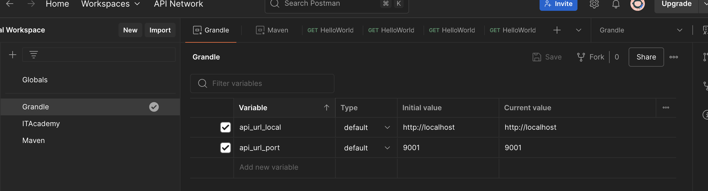

# Readme for Exercise: Postman – Testing Spring Projects with Environments

## 📄 Description

This exercise introduces the use of **Postman** to test Spring-based web services. You'll create and configure Postman environments to interact with Spring projects running under different build tools (Maven and Gradle), exploring how to handle environment variables and HTTP requests.

---

## 🚀 Exercise

### Exercise 1: Postman Environments for Spring Projects

Set up and test two Spring Boot projects (one built with Maven and another with Gradle) using Postman.

#### 🧩 Functionality:

* Create two Postman environments:

  * **Maven Project Environment**
---

---
  * **Gradle Project Environment**
---

---
* Each environment must include:

  * `Servidor` variable: `http://localhost` (same for both)
  * `Port` variable:

    * `9000` for Maven
    * `9001` for Gradle
* Use these environments to test endpoints in your Spring projects.
* Suggested URL format: `{{Servidor}}:{{Port}}/HelloWorld/elmeunom` or any valid endpoint implemented in the projects.
* Maven:
  ---
  
  ---
  
  ---
  
  ---

* Grandle
  ---
  
  ---
  
  ---
  
  ---

#### 🏗️ Required Components:

* Two Spring Boot projects (one using **Maven**, one using **Gradle**)
* Postman installed and configured
* Two Postman environments with the specified variables
* Eclipse (or compatible IDE) running both projects concurrently

---

## 💻 Technologies Used

* Java
* Spring Boot
* Maven & Gradle
* Postman
* HTTP Protocol

## 📋 Requirements

* JDK 8 or higher
* Eclipse IDE (or compatible with Spring Boot)
* Postman (desktop or web version)

---

## 📎 Deliverables

* ✅ 2 JSON files: exported Postman environments (one for Maven, one for Gradle)
* ✅ 2 screenshots showing Postman requests using the correct environment and variables
* ✅ Both Spring projects running and accessible at their respective ports (9000 and 9001)
